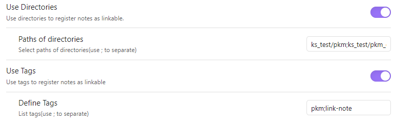

# Suggest Notes

[](https://www.youtube.com/watch?v=6aFwVIqfgIQ)

**[한국어](#한국어) | [English](#english)**

> Obsidian에서 문장을 작성하다가 연결할 노트를 바로 찾아 링크로 바꾸는 인라인 자동완성 플러그인입니다.

---

## 한국어

### 문제와 해결

Obsidian의 기본 내부 링크는 `[[`를 입력한 뒤 검색 팝업에서 노트를 찾아야 합니다. 노트를 쓰는 흐름 안에서 이미 떠올린 개념을 연결하기에는 이 전환이 불필요하다고 느꼈습니다.

Suggest Notes는 현재 입력 중인 단어를 접두사로 검색해, 설정한 범위의 노트를 인라인으로 제안합니다. 항목을 선택하면 입력한 단어가 `[[노트 경로|입력한 키워드]]` 링크로 교체됩니다. 사용자는 폴더 경로와 태그로 제안 대상을 좁혀, 큰 vault에서도 의도한 노트만 빠르게 연결할 수 있습니다.

### 사용자 경험

- 공백 또는 탭으로 구분된 단어를 두 글자 이상 입력하면 제안을 표시합니다.
- 노트 제목과 frontmatter `aliases`를 모두 검색합니다.
- 최근 사용한 항목과 누적 사용 빈도를 반영해 최대 8개를 정렬합니다.
- 대소문자를 구분하지 않으며, 현재 노트 자신과 코드 블록에서는 제안하지 않습니다.




### 설계와 기술적 판단

| 과제 | 선택 | 이유와 트레이드오프 |
| --- | --- | --- |
| 타이핑 중 검색 지연 | 접두사 Trie | 각 노드에 하위 후보의 정렬된 목록을 유지해 조회를 빠르게 만들었습니다. 대신 노트·메타데이터 변경 시 경로를 따라 후보 목록을 갱신하는 비용과 메모리를 감수했습니다. |
| 추천 기준의 변경 가능성 | 검색 구조와 통계 정책 분리 | Trie는 `Statistic` 인터페이스만 사용하고, Obsidian 영역의 `RecentStatistic`이 최근성·빈도를 정합니다. 검색 자료구조를 수정하지 않고 랭킹 정책을 교체할 수 있습니다. |
| 불완전한 Plugin API와 테스트 난이도 | 순수 TypeScript 도메인 모듈 분리 | Obsidian API에 의존하는 이벤트·UI 계층과 Trie를 분리해 Jest 단위 테스트와 빠른 디버깅 반복을 가능하게 했습니다. |
| 모호한 API 동작 확인 | API 실험과 DevTools 디버깅 | `EditorSuggest`, vault/metadata 이벤트를 실제로 검증하고, Electron DevTools·소스맵·hot reload로 런타임 동작을 추적했습니다. |

Trie는 제목·alias의 접두사에 해당하는 노드를 찾은 뒤 사전 정렬된 후보를 읽습니다. 삽입·삭제·이름 변경은 vault와 metadata 이벤트를 통해 인메모리 인덱스에 반영합니다. 의도하지 않은 제안보다 명시적으로 입력한 접두사 검색을 우선해, fuzzy matching 대신 예측 가능한 실시간 응답을 선택했습니다.

### 구현 구성

- [`srcs/trie.ts`](srcs/trie.ts) — 대소문자 비구분 Trie, 후보 정렬·전파, 통계 추상화
- [`obsidian_srcs/main.ts`](obsidian_srcs/main.ts) — `EditorSuggest`, 링크 삽입, vault·metadata 이벤트 동기화
- [`obsidian_srcs/statistic.ts`](obsidian_srcs/statistic.ts) — 최근 사용과 사용 횟수 기반 랭킹 정책
- [`srcs/__tests__/test_trie.ts`](srcs/__tests__/test_trie.ts) — Obsidian과 독립적으로 실행되는 Trie 단위 테스트
- [`.github/workflows/release.yml`](.github/workflows/release.yml) — 태그 push 시 빌드하고 배포 산출물을 포함한 GitHub Release 초안 생성

**기술 스택:** TypeScript, Obsidian Plugin API, Jest, esbuild, GitHub Actions

### 실행 및 개발

```bash
npm install
npm run dev    # esbuild watch 모드
npm test       # Jest 단위 테스트
npm run build  # 타입 검사, manifest/versions 동기화, production build
```

개발 빌드는 소스맵을 포함합니다. Obsidian의 DevTools와 hot-reload를 함께 사용하면 번들된 JavaScript 대신 TypeScript 기준으로 브레이크포인트와 호출 흐름을 확인할 수 있습니다.

### 프로젝트 상태

이 프로젝트는 자료구조 기반의 실시간 추천, 외부 API 경계 분리, TDD, Electron 환경의 프로파일링과 CI/CD를 경험하기 위해 만든 개인 프로젝트입니다. 현재는 기능을 적극적으로 확장하거나 유지보수하지 않습니다. 일반 사용 목적이라면 [Various Complements](https://github.com/tadashi-aikawa/obsidian-various-complements-plugin)처럼 활발히 관리되는 대안을 권합니다.

### 관련 글

- [Suggest Notes Plugin 개요 및 주요 아이디어](https://harsh-wavelength-48b.notion.site/Suggest-Notes-Plugin-e1b270542fd54e30b59cf9366c1328d9?source=copy_link)
- [Obsidian Plugin 개발 가이드 — Obsidian Plugin API의 보완 및 디버깅 중심](https://harsh-wavelength-48b.notion.site/Obsidian-Plugin-Obisidian-Plugin-API-35010f228487427192f7dd88bfd95e15?source=copy_link)
- [Debugging an Obsidian Plugin — why I don't separate business logic](https://harsh-wavelength-48b.notion.site/Debugging-Obsidian-Plugin-Why-I-don-t-separate-business-logics-742979440a8d47a9808180a09a702d5d?source=copy_link)

### Feedback

Bug reports and suggestions: khs1903b@gmail.com

---

## English

### Problem and solution

Obsidian's native internal linking requires typing `[[` and then finding a note in a search popup. That context switch is unnecessary when a related concept is already in mind while writing.

Suggest Notes searches the word currently being typed as a prefix and presents inline suggestions from a user-defined scope. Selecting an item replaces that word with a `[[note path|typed keyword]]` link. Folder paths and tags let users restrict suggestions to the notes that matter, even in large vaults.

### Experience

- Shows suggestions after two or more characters in a space- or tab-delimited word.
- Searches both note titles and frontmatter `aliases`.
- Ranks up to eight results by recent use and cumulative link frequency.
- Matches case-insensitively and suppresses self-links and suggestions inside code blocks.


### Design decisions

| Challenge | Choice | Rationale and trade-off |
| --- | --- | --- |
| Search latency while typing | Prefix Trie | Each node keeps an ordered list of descendant candidates for fast reads. This trades memory and update work on the path for responsive suggestions. |
| Evolvable ranking | Separate search structure and statistics policy | The Trie depends only on `Statistic`; Obsidian-side `RecentStatistic` supplies recency and frequency ranking. Policies can change without modifying the data structure. |
| Incomplete Plugin API and hard-to-test runtime | Isolated pure TypeScript domain module | Keeping the Trie separate from Obsidian event and UI code makes Jest unit tests and fast debug iterations practical. |
| Unclear API behavior | API experiments and DevTools debugging | I validated `EditorSuggest` and vault/metadata events in the runtime, then used Electron DevTools, source maps, and hot reload to trace behavior. |

The plugin finds the Trie node for a title or alias prefix, then reads its pre-sorted candidates. Vault and metadata events keep the in-memory index current for additions, edits, deletions, and renames. I deliberately chose predictable prefix matching over fuzzy matching for intentional, real-time invocation.

### Implementation map

- [`srcs/trie.ts`](srcs/trie.ts) — case-insensitive Trie, ordered candidate propagation, and the statistics abstraction
- [`obsidian_srcs/main.ts`](obsidian_srcs/main.ts) — `EditorSuggest`, link insertion, and vault/metadata event synchronization
- [`obsidian_srcs/statistic.ts`](obsidian_srcs/statistic.ts) — recency- and frequency-based ranking
- [`srcs/__tests__/test_trie.ts`](srcs/__tests__/test_trie.ts) — Trie unit tests isolated from Obsidian
- [`.github/workflows/release.yml`](.github/workflows/release.yml) — creates a GitHub Release draft with build artifacts when a tag is pushed

**Stack:** TypeScript, Obsidian Plugin API, Jest, esbuild, GitHub Actions

### Run and develop

```bash
npm install
npm run dev    # esbuild watch mode
npm test       # Jest unit tests
npm run build  # type-check, sync manifest/versions, production build
```

Development builds include source maps. With Obsidian DevTools and hot reload, breakpoints and call flows can be inspected against TypeScript rather than the bundled JavaScript.

### Project status

This personal project was built to explore real-time recommendation with data structures, external-API boundaries, TDD, Electron profiling, and CI/CD. It is not actively maintained or expanded. For everyday use, consider the actively maintained [Various Complements](https://github.com/tadashi-aikawa/obsidian-various-complements-plugin).

### Writing

- [Korean: Suggest Notes Plugin overview and core ideas](https://harsh-wavelength-48b.notion.site/Suggest-Notes-Plugin-e1b270542fd54e30b59cf9366c1328d9?source=copy_link)
- [Korean: Obsidian Plugin development guide — API gaps and debugging](https://harsh-wavelength-48b.notion.site/Obsidian-Plugin-Obisidian-Plugin-API-35010f228487427192f7dd88bfd95e15?source=copy_link)
- [English: Debugging an Obsidian Plugin — why I don't separate business logic](https://harsh-wavelength-48b.notion.site/Debugging-Obsidian-Plugin-Why-I-don-t-separate-business-logics-742979440a8d47a9808180a09a702d5d?source=copy_link)

### License

[MIT](LICENSE)
